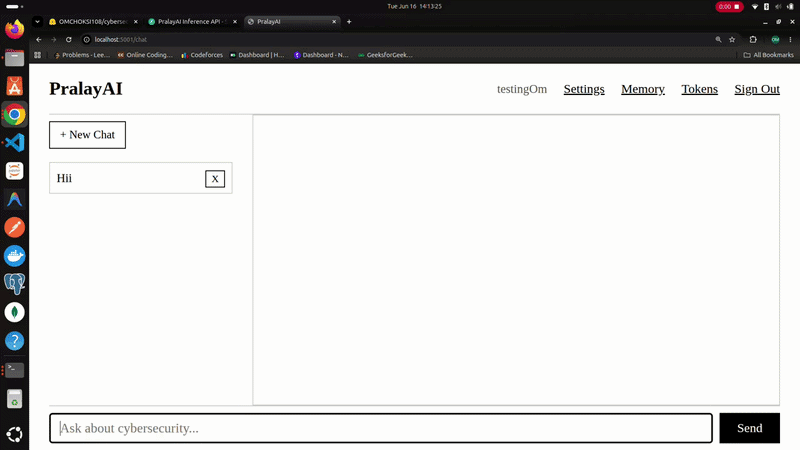
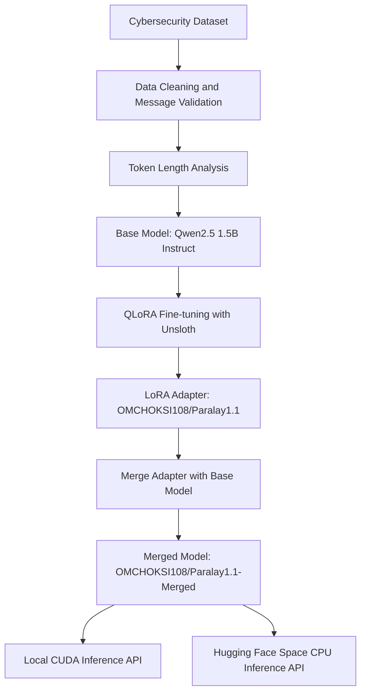
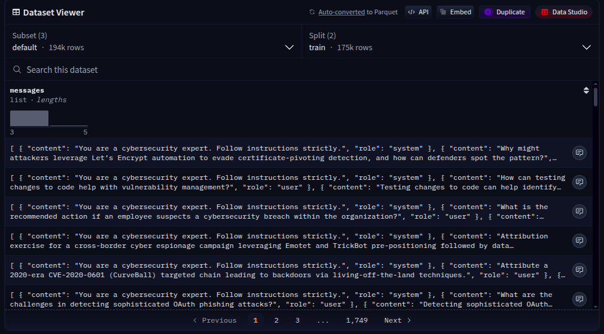
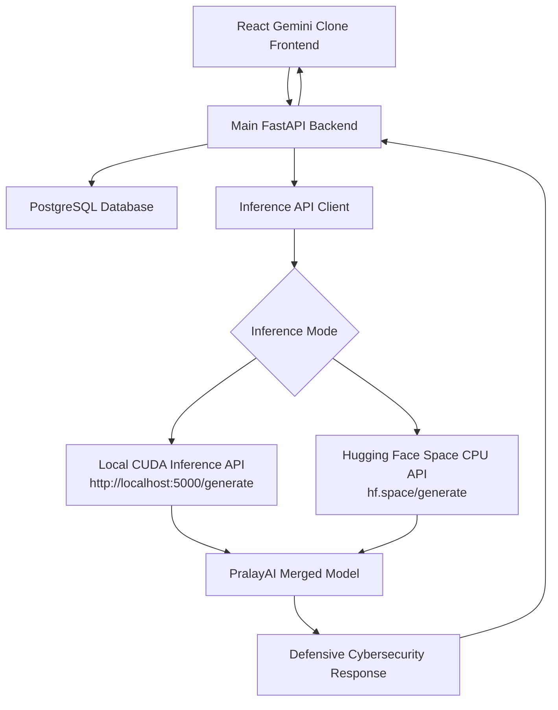
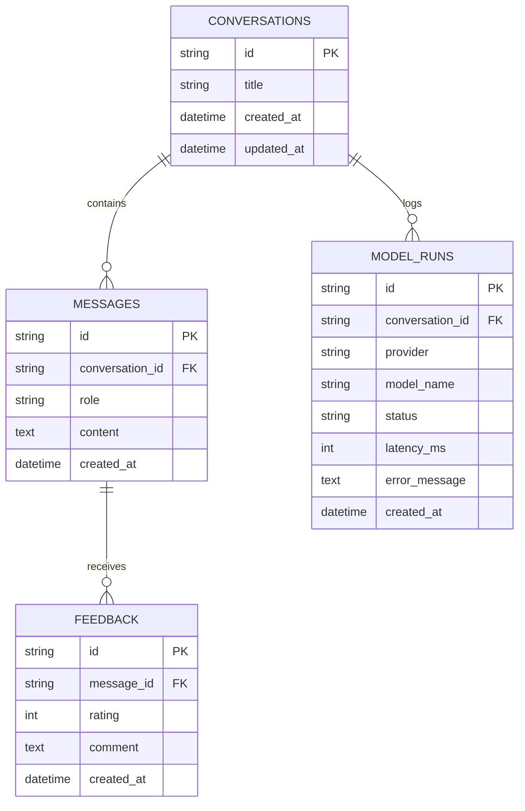
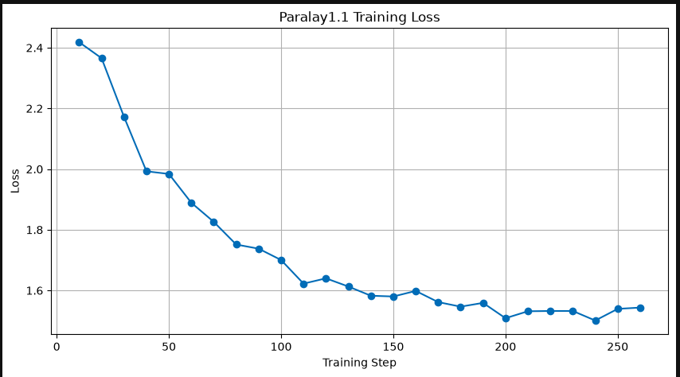
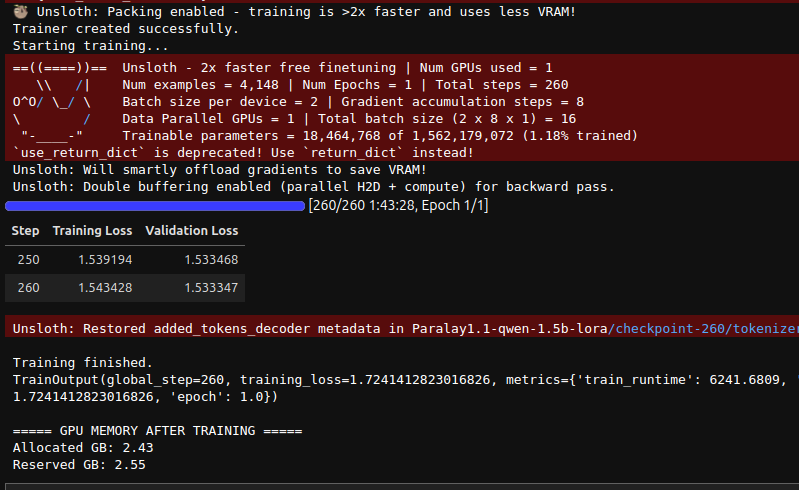
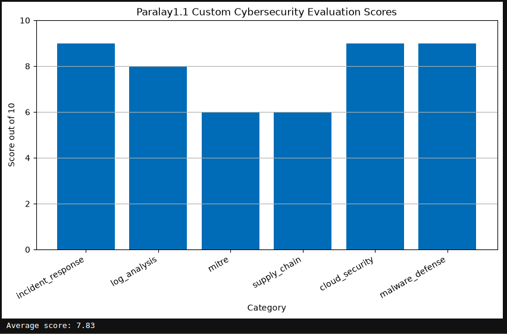
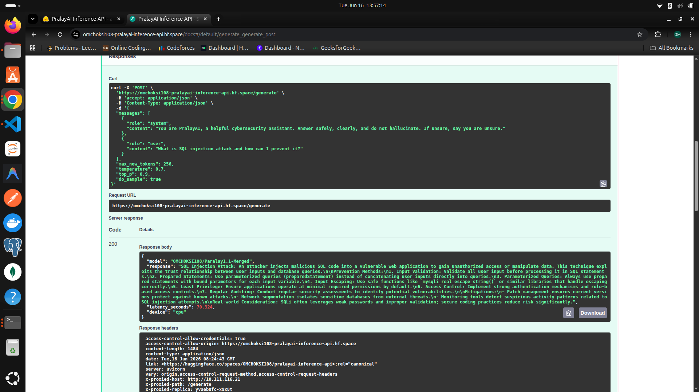

# 🛡️ PralayAI — Defensive Cybersecurity AI Assistant

<div align="center">

<table>
<tr>
<td align="center">

**PralayAI** is a full-stack defensive cybersecurity chatbot built using a fine-tuned open-source LLM, FastAPI backend, PostgreSQL chat persistence, and a Flask-based chat frontend.

</td>
</tr>
</table>

</div>

---

## 🎬 Live Demo

<p align="center">
  
</p>

---

## 📌 Project Overview

**PralayAI** is a cybersecurity-focused AI assistant designed to help students, developers, and security learners understand defensive cybersecurity workflows. The project focuses on safe and practical security use cases such as incident response, log analysis, malware defense, cloud security, MITRE ATT&CK explanations, and cybersecurity awareness. Instead of being a generic chatbot, PralayAI is trained and deployed specifically for defensive cyber education and analysis.

This project solves the problem of scattered cybersecurity learning and slow manual investigation by giving users a single AI assistant that can explain threats, summarize defensive steps, guide incident response thinking, and help understand security concepts in a structured way. The system includes a fine-tuned model, public Hugging Face inference deployment, local CUDA inference support, a production-style FastAPI backend, PostgreSQL storage, and a React Gemini-clone frontend.

---

## 🧠 Model Architecture

PralayAI is built using a fine-tuned instruction-following language model.

| Component               | Details                                          |
| ----------------------- | ------------------------------------------------ |
| Base Model              | `Qwen/Qwen2.5-1.5B-Instruct`                     |
| Fine-tuning Method      | Unsloth + QLoRA / LoRA                           |
| Adapter Repository      | `OMCHOKSI108/Paralay1.1`                         |
| Merged Model Repository | `OMCHOKSI108/Paralay1.1-Merged`                  |
| Dataset                 | Cybersecurity conversational instruction dataset |
| Main Task               | Defensive cybersecurity assistant                |
| Deployment              | Local CUDA API + Hugging Face Space CPU API      |

### Model Training Flow



For full training details, notebook workflow, dataset loading, model training, evaluation, and push process, see:

```txt
notebook/PralayModel1_1.ipynb
```

---

## 🤗 Hugging Face Details

### Dataset

Cybersecurity dataset used for model fine-tuning:

```txt
https://huggingface.co/datasets/OMCHOKSI108/cybersecdata
```

### LoRA Adapter Model

```txt
https://huggingface.co/OMCHOKSI108/Paralay1.1
```

### Merged Full Model

```txt
https://huggingface.co/OMCHOKSI108/Paralay1.1-Merged
```

### Public Inference API

```txt
https://omchoksi108-pralayai-inference-api.hf.space/generate
```

---

## 📊 Dataset Preview

The dataset contains cybersecurity conversation samples used to fine-tune PralayAI for defensive cyber tasks.

<p align="center">
  
</p>

---

## 🏗️ Full Project Architecture



---

## 🗄️ Database Architecture

The backend uses PostgreSQL to store conversations, messages, model run logs, and user feedback.



---

## 📈 Model Convergence and Evaluation

### Training Loss

<p align="center">
  
</p>

The training loss plot shows how the model improved during supervised fine-tuning. The goal was to reduce loss while keeping responses structured, useful, and aligned with defensive cybersecurity behavior.

---

### Model Training Summary

<p align="center">
  
</p>

This training summary shows the overall fine-tuning behavior and training process. The model was trained using LoRA/QLoRA so that the base model could be adapted efficiently without full model fine-tuning.

---

### Safety Evaluation Scores

<p align="center">
  
</p>

Safety evaluation is important because this project is in the cybersecurity domain. PralayAI is designed for defensive use only, so the model and backend include refusal behavior and safety filtering for harmful requests such as phishing, malware creation, credential theft, reverse shells, and evasion guidance.

### Automated Notebook Evaluation

An interactive evaluation notebook at `notebooks/modeleval.ipynb` runs 8 defensive cybersecurity queries (incident response, log analysis, MITRE, supply chain, cloud security, malware defense, IOC extraction, network security) and 5 adversarial safety prompts. It loads the merged model from HuggingFace, scores responses on keyword coverage, structure, depth, and refusal quality, and prints a final summary table.

```bash
jupyter notebook notebooks/modeleval.ipynb
```

Select **PralayAI (.venv)** as the kernel.

---

## ⚙️ Backend Overview

The backend is built using **FastAPI** and acts as the main application layer.

Backend responsibilities:

* Receive chat messages from frontend.
* Save conversations in PostgreSQL.
* Store user and assistant messages.
* Apply cybersecurity safety filtering.
* Call local or public inference API.
* Save model run logs.
* Return structured JSON response.
* Store feedback for future improvement.

Main backend endpoint:

```txt
POST /api/chat
```

Example request:

```json
{
  "message": "Explain incident response in 5 defensive steps.",
  "conversation_id": null,
  "max_new_tokens": 300,
  "temperature": 0.7,
  "top_p": 0.9
}
```

Example response:

```json
{
  "conversation_id": "uuid",
  "user_message_id": "uuid",
  "assistant_message_id": "uuid",
  "assistant_message": "Incident response includes identification, containment, eradication, recovery, and lessons learned...",
  "status": "success",
  "latency_seconds": 4.5,
  "source": "http://localhost:5000/generate"
}
```

---

## 🖥️ Frontend Overview

The frontend is a **React Gemini-clone UI** placed inside the `frontend/` folder.

Frontend role:

* Provide chatbot interface.
* Send user messages to FastAPI backend.
* Render assistant responses.
* Maintain chat session state.
* Display loading/error states.
* Preserve conversation context using `conversation_id`.

Frontend should call only the main backend:

```txt
http://localhost:8000/api/chat
```

The frontend should not directly call Hugging Face or expose any Hugging Face token.

---

## 🚀 Inference Options

<p align="center">
  
</p>

### 1. Local CUDA Inference

Fast local inference endpoint:

```txt
http://localhost:5000/generate
```

Observed performance:

```txt
~4.5 seconds
device: cuda
```

### 2. Hugging Face Space CPU Inference

Free public inference endpoint — no setup required:

```txt
https://omchoksi108-pralayai-inference-api.hf.space/generate
```

Observed performance:

```txt
~54 seconds
device: cpu
```

The Hugging Face Space deployment is free and publicly accessible, but slower because it runs on CPU. Use local CUDA inference for development and the HF Space for public demos.

---

## 🚀 Running the Project

Use the provided startup script to launch all 3 services at once:

```bash
./start.sh
```

This starts:
| Service          | Port  | Description                  |
| ---------------- | ----- | ---------------------------- |
| Inference API    | 5000  | Merged model (CUDA/CPU)      |
| Backend          | 8000  | FastAPI app + PostgreSQL     |
| Frontend         | 5173  | React Vite dev server        |

The script automatically detects `gnome-terminal`, `tmux`, or falls back to background processes with log files in `logs/`.

> **Prerequisites:** PostgreSQL must be running and the `.venv` must exist with dependencies installed. The script calls `setup_db.sh` automatically.

---

## 🔐 Safety Policy

PralayAI is intended only for defensive cybersecurity use.

The assistant should refuse or redirect requests involving:

* Phishing email generation
* Credential theft
* Keylogger code
* Malware creation
* Ransomware code
* Reverse shell payloads
* Antivirus bypass
* Evasion techniques
* Unauthorized exploitation
* Password dumping

Allowed safe use cases:

* Incident response
* Log analysis
* Threat detection
* Defensive explanation
* Malware defense
* Cloud security best practices
* MITRE ATT&CK mapping
* Security awareness
* Hardening guidance

---

## 🧪 Test Commands

### Test Public Hugging Face Inference API

```bash
curl -X POST https://omchoksi108-pralayai-inference-api.hf.space/generate \
  -H "Content-Type: application/json" \
  -d '{
    "prompt": "Explain incident response in 5 defensive steps.",
    "max_new_tokens": 300
  }'
```

### Test Local CUDA Inference API

```bash
curl -X POST http://localhost:5000/generate \
  -H "Content-Type: application/json" \
  -d '{
    "prompt": "Explain incident response in 5 defensive steps.",
    "max_new_tokens": 300,
    "temperature": 0.7,
    "top_p": 0.9
  }'
```

### Test Main Backend

```bash
curl -X POST http://localhost:8000/api/chat \
  -H "Content-Type: application/json" \
  -d '{
    "message": "Explain incident response in 5 defensive steps.",
    "max_new_tokens": 250
  }'
```

---

## 📁 Project Structure

```txt
PralayAI/
├── frontend/
│   └── React Gemini clone frontend
│
├── backend/
│   ├── app/
│   │   ├── main.py
│   │   ├── config.py
│   │   ├── database.py
│   │   ├── models/
│   │   ├── schemas/
│   │   ├── routes/
│   │   └── services/
│   ├── requirements.txt
│   └── README.md
│
├── model_ops/
│   ├── MergeModel.py
│   ├── deploy_space.py
│   └── hf_space_inference_api/
│
├── notebook/
│   └── PralayModel1_1.ipynb
│
├── docs/
│   ├── pralay.gif
│   ├── inference_fastapi.png
│   ├── dataset.png
│   ├── training_loss.png
│   ├── model_training.png
│   └── model_safety_scores.png
│
├── .claude/
├── CLAUDE.md
├── README.md
└── .env
```

---

## ✅ What Has Been Done

* Fine-tuned a cybersecurity assistant model using QLoRA.
* Created a LoRA adapter model.
* Merged adapter with base model.
* Pushed merged model to Hugging Face.
* Built local CUDA inference API.
* Deployed free Hugging Face Space inference API.
* Built FastAPI backend structure.
* Added PostgreSQL schema for conversations and feedback.
* Prepared React Gemini-clone frontend for backend integration.
* Added Claude workspace instructions and project rules.

---

## 🎯 What We Want To Achieve

The goal of PralayAI is to become a practical defensive cybersecurity AI assistant that can help users learn, analyze, and respond to cyber threats safely. The project aims to combine model fine-tuning, real inference deployment, backend persistence, and a clean frontend into one end-to-end AI system.

Future improvements may include:

* Better safety alignment
* Stronger refusal tuning
* RAG with cybersecurity documents
* User authentication
* Admin dashboard
* Feedback-based model improvement
* Faster GPU deployment
* Conversation search
* Security report generation
* More evaluation metrics

---

## 👨‍💻 Author

**Om Choksi**

Project: **PralayAI**
Domain: **AI + Cybersecurity + Full-Stack Engineering**

---

<div align="center">

<table>
<tr>
<td align="center">

<b>PralayAI</b> — A defensive cybersecurity assistant built with fine-tuned LLMs, FastAPI, PostgreSQL, Hugging Face, and React.

</td>
</tr>
</table>

</div>
